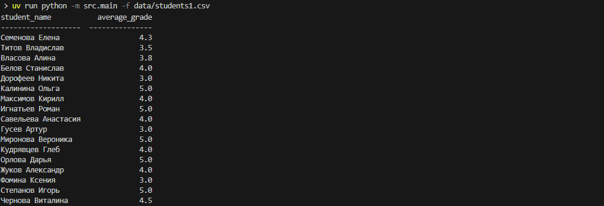
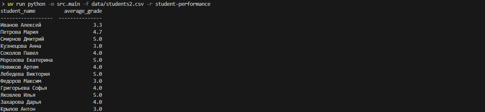
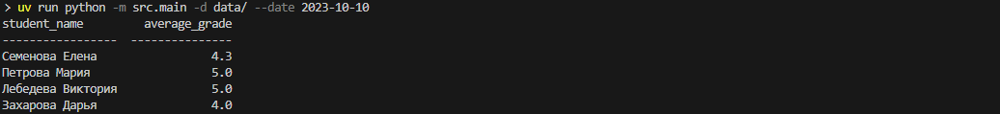

## StudentPerformance
Тестовый проект для обработки csv-файлов.

## Примеры запуска:
- uv run python -m src.main -f data/students1.csv

- uv run python -m src.main -f data/students2.csv -r student-performance

- uv run python -m src.main -d data/ --date 2023-10-10

## Поддерживаемые опции:
- -f, --file: путь к одному или нескольким лог-файлам
- -d, --dir: путь к директории с логами
- --report: тип отчета
- --date: фильтрация записей по дате

### Если указана дата, будут обрабатываться только записи с совпадающей датой.

### Как добавить новый тип отчёта:

1) Создайте класс-отчёт, унаследованный от AbstractReporter.
2) Добавьте его в перечисление main.ReportTypeEnum
